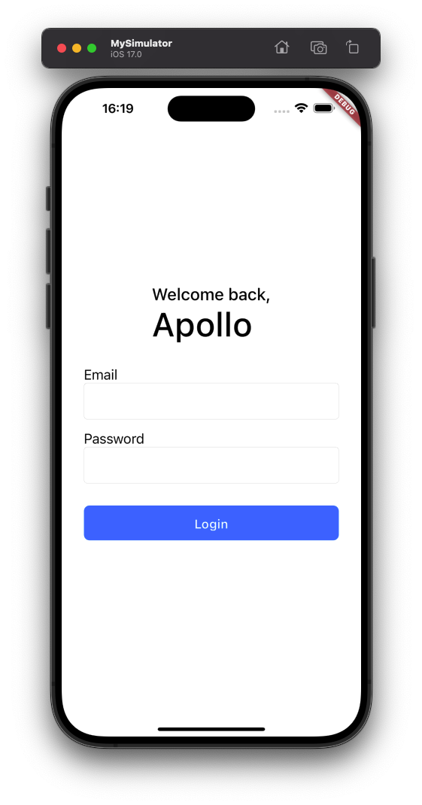
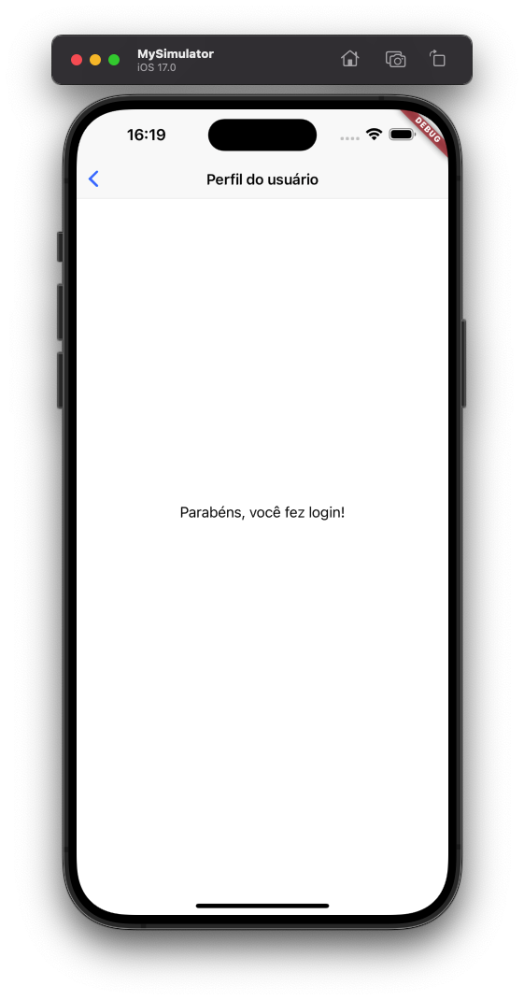

# Cupertino test application
This is a Flutter app that uses widgets and themes from Cupertino.
Consists of a login screen and a post-login screen.

The application, as it is a test app, does not use an authentication system, it only checks if the password is equal to "12345678".

## Login And Post Login screen

